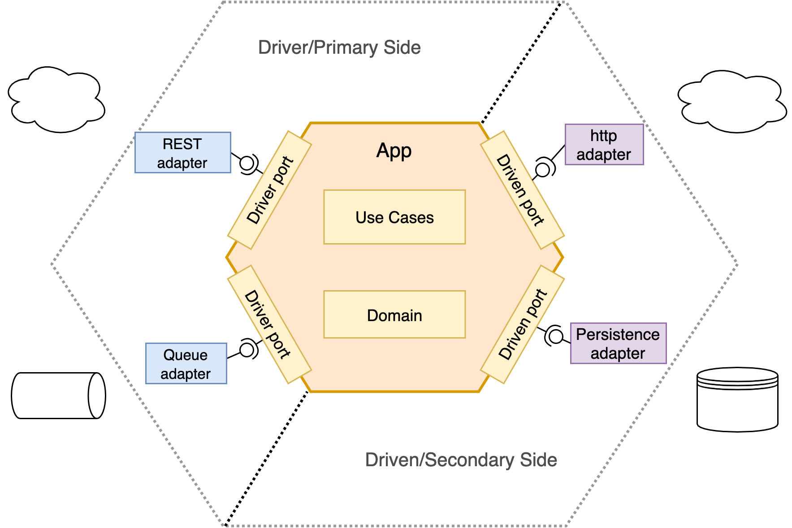
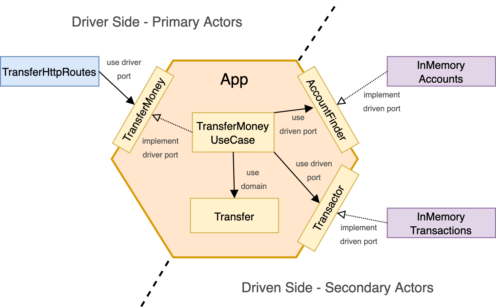

# Implementing hexagonal architecture

The idea of this project is to understand and see how we can apply hexagonal architecture in terms of packaging
, naming, structure and all concerns that you can face in a real project.

Everything will be covered with test during the process because it has been done doing outside-in tdd.

## Hexagonal architecture overview

Hexagonal architecture is an architectural pattern, a way to build and structure your applications in order to obtain
  testable, loosely-coupled, framework agnostic, domain-centric, easy to evolve and less prone to errors applications.
 
But hexagonal is not a new trend, it has been here for a while, this kind of architecture was invented by [Alistair
 Cockburn](https://en.wikipedia.org/wiki/Alistair_Cockburn) in an made public in an [article](https://alistair.cockburn.us/hexagonal-architecture/) published in 2005.
 
It is important to mention that hexagonal, like onion or clean architectures are a family of architectural patterns
 that rely on a pattern described by Rover C. Martin (Uncle Bob) in 1996, the [dependency inversion principle](https://blog.cleancoder.com/uncle-bob/2016/01/04/ALittleArchitecture.html), the D of solid, as a base pattern.

### AKA Ports and Adapters

When people talk about hexagonal architecture, they used to talk about layers, but in hexagonal architecture there
 are no layers, it is all about ports, adapters and of course, dependency inversion.
 
As we just said, the whole idea is around *Ports* and *Adapters*, let's see what they mean ...

This is how a typical hexagonal app looks like:

<p align="center">
  
</p>

#### App: 
The core of the hexagon, all the app code lives here, it is **isolated from the rest of the world**, only dependencies
 within itself.
- *Domain*: The heart of our application, all the business logic, state and behavior.
- **Ports**: **The boundary of the hexagon**, every communication from/to the outside world to our app will be through
 these boundaries, they are just interfaces.
    - *Driver/primary/input*:An input port is a simple interface that can be called by the entrypoints and it is
     implemented by a use case, basically it is the API of the application. *Here, adapter (entrypoint like http
      controller, sqs consumer ...) calls the app through a port*
     
    - *Driven/secondary/output*: a simple interface that can be called by our use cases or domain (inside the hexagon
    ) if they need something from the outside (database access, for instance), this is an application of the
     Dependency Inversion Principle (the “D” in SOLID). *Here, the relationship of Port and Adapter is inverted
     , app calls an adapter (DB, aws ...) through a port*
      
- *Use cases*: They implement the driver ports, they expose the functionality of the app orchestrating actions or steps
 defining the interactions within the domain and ports. 
    
#### Outside world: the infrastructure

This layer is where all components outside of our app live, the I/O components UI, database, frameworks, libs
, devices, clients... everything but the app core.
- **Adapters**: In hexagonal architecture all the primary and secondary actors interact with the application ports
 through adapters, they are the translators between the domain and the infrastructure. 
    - *Driver/primary/input*: Primary adapters or “driving” adapters, they call the driver ports to initiate
         interactions with the app, the entrypoints to our app. (controllers, schedulers, queue consumers, console ...)
         A driver adapter uses a driver port interface, converting a specific technology request into a technology agnostic 
         request to a driver port.
         
    - *Driven/secondary/output*: They implement the driven ports of our domain, they adapt any external interaction
         with the outside world to our domain, they are called from our app domain/usecases. (database, http-clients
          ...)

## Application overview: banking application

To drive all the project we need a real project, a real domain where we can see in a simple and pragmatic way how we
 can apply this super-useful architectural pattern.
 
In this example we will implement a simple use-case, a transfer between two accounts of the same bank, and here, our
 user story:
```text
As a customer of the Bank
I want to transfer money to other customer of this bank
So that, I can make an instant transfer
```

Having said that, our app will be a simple banking app with one use case, we will try to apply the most simple 
 hexagonal approach that could be extrapolated for a bigger and complex application.

Next diagram shows how our components fit in the hexagon:

<p align="center">
  
</p>

Trying to stick on the principles of the original idea of Alistair Cockburn and also influenced by Uncle Bob, we have
 tried to organize the code around these ideas; this is just a personal approach from the original article, so don't
  take it as a bible ;).

### Code structure

These are the packages of our app, hexagonal does not force to have any pakage structure, it's all about ports and
 adapters, but we have tried to **go-by-the-book** and follow Alistair Cockburn first idea: 
 ```kotlin
`-- com
    `-- bank
        `-- transfers
            |-- app // the inner hexagon
            |   |-- domain // our domain model
            |   |-- port // boundaries
            |   |   |-- driver // inbound/left boundary to the hexagon (interfaces), hexagon entrypoint
            |   |   `-- driven // outbound/right boundary to the hexagon (interfaces), hexagon calls to the outside
            |   `-- usecase // implement driver ports, orchestrators of the app exposed use-cases
            `-- infrastructure // outside world
                `-- config // framework config & wiring
                `-- adapter
                    |-- driver // use/call driver port interfaces
                    `-- driven // implement driven ports

```
You can notice that, we have separated the `app` from `infrastructure`, this separation comes from the original
 [diagrams](https://alistair.cockburn.us/hexagonal-architecture/) drawn in 2005, where you have the app, the core of
  your hexagon, and then the rest, the IT infrastructure, the composite hardware, software, network resources and
   services.  

### Important note: modern approaches

Maybe this an approach is a bit verbose in terms of naming and packaging, but it is made for the sake of understanding
 the pattern.

Modern approaches are based/inspired on this idea, omitting ports and adapters packages/names, using
 packaging by [package-by-feature](http://www.codingthearchitecture.com/2015/03/08/package_by_component_and_architecturally_aligned_testing.html) or [package-by-component](https://herbertograca.com/2017/11/16/explicit-architecture-01-ddd-hexagonal-onion-clean-cqrs-how-i-put-it-all-together/).
  
Hexagonal is also usually mixed with other patterns like CQRS or DDD, like Vaughn Vernon [does in his samples od DDD](https://github.com/VaughnVernon/IDDD_Samples).

#### Modern layering

It is important to mention that it is almost a convention in all hexagonal projects to follow the following packaging
 and layering:
 
 - Application: Application Services (the use cases) 
 - Domain model: domain and ports
 - Infrastructure: adapters

We didn't follow these trends because we wanted to follow the original idea.

## tech stack

* Language: Kotlin
* JVM: 1.8.0*
* Web server: [Ktor](https://ktor.io/)
* Testing libraries/frameworks:
    * [JUnit 5](https://junit.org/junit5/docs/current/user-guide/)
    * [Assertj](https://joel-costigliola.github.io/assertj/)
    * [Mockk](https://mockk.io/)
    * [REST Assured](http://rest-assured.io/)

## Running tests
```shell
./gradlew test
```
## Run the app
```shell
./gradlew build
java -jar build/libs/implementing-hexagonal-architecture-all.jar 
```

## Links
- [Original article](https://alistair.cockburn.us/hexagonal-architecture/)
- [Ports and adapters](https://softwarecampament.wordpress.com/portsadapters/).
- [Hexagonal blog post](https://kurron.bitbucket.io/004/index.html)
